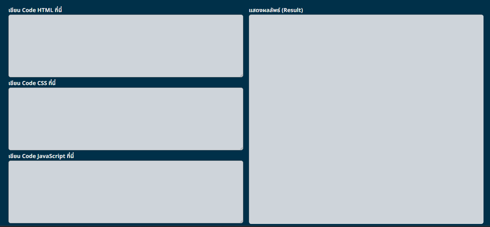

# Code-Editor-Page-Pratice
This website serves as a coding practice platform, allowing users to input HTML, CSS, and JavaScript code directly on the webpage for immediate display of results. The current version does not include logic for checking code errors or utilizing syntax notations, but these features will be developed in the future. If you have additional suggestions for further development, please feel free to share them.

Solution URL: [https://github.com/hedisnice/Calculator-app-solution]

Live Site URL: [https://hedisnice.github.io/Code-Editor-Page-Pratice/]
